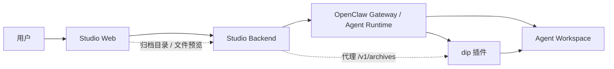
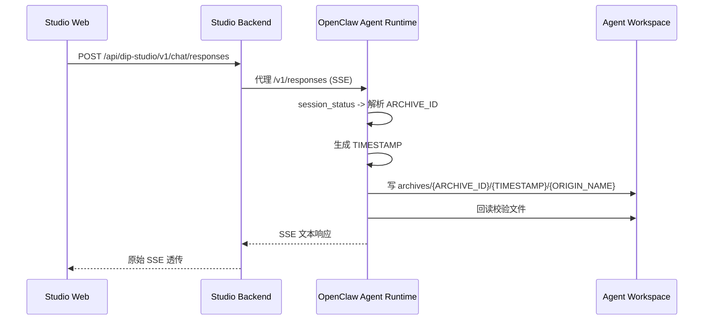
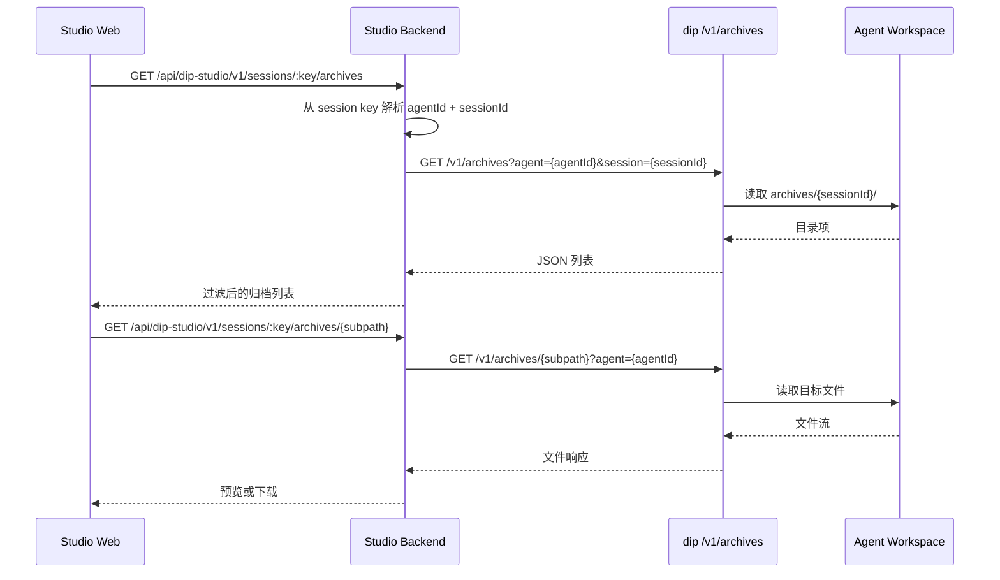
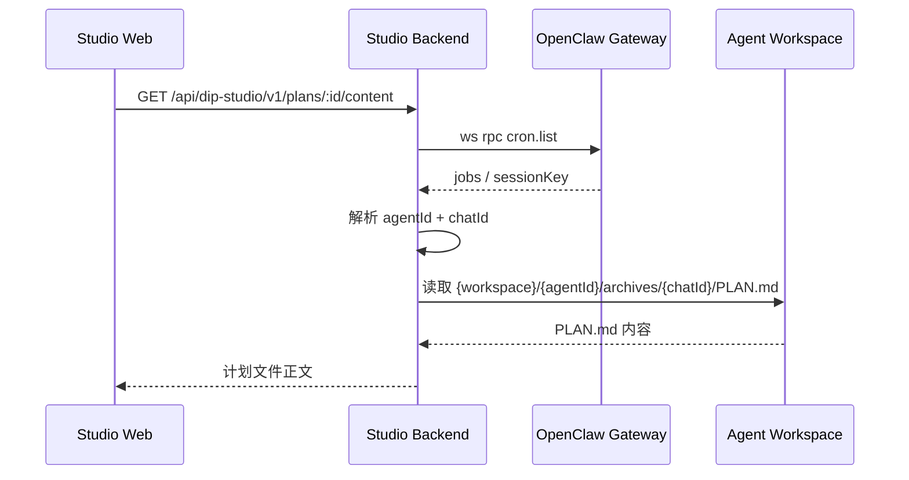

# 归档物（实现方案）

## 1. 目标与边界

**目标**：定义当前归档物在 Studio + OpenClaw 中的实现方案，确保数字员工在写入 `PLAN.md`、报告、JSON、摘要等文件时，遵守统一归档规则，并可被 Web 侧列举、预览和渲染。

**覆盖范围**：

- 数字员工写文件前后的归档协议约束。
- `dip` 插件对工作区 `archives/` 的访问与整理。
- Studio Backend 对会话归档目录的代理查询。
- Web 侧对归档目录与文件预览的展示。

**不在本文范围**：

- 业务文件内容本身的生成逻辑。
- `schedule-plan` 的 ORA 拆解细节；本文只描述其与归档协议的衔接。
- 对 OpenClaw 核心工具协议本身的实现细节；本文只描述归档链路中的集成要求。

---

## 2. 术语与约束

`studio/extensions/dip/skills/archive-protocol/SKILL.md` 定义了归档物的硬约束，Studio 侧实现必须以此为准：

1. **ARCHIVE_ID 唯一来源**：只能来自 `session_status` 返回的 `sessionKey` 最后一段。
2. **TIMESTAMP 固定格式**：写普通归档物前生成 `YYYY-MM-DD-HH-MM-SS`。
3. **双轨路径**：
   - `PLAN.md`：`archives/{ARCHIVE_ID}/PLAN.md`
   - 普通归档物：`archives/{ARCHIVE_ID}/{TIMESTAMP}/{ORIGIN_NAME}`
4. **写后强制校验**：必须回读，确认文件存在、路径正确、内容非空、内容与当前任务一致。
5. **状态回执**：
   - 失败：`ARCHIVE_STATUS: BLOCKED`、`ARCHIVE_REASON: ...`
   - 成功：`ARCHIVE_STATUS: OK`、`ARCHIVE_ROOT: archives/{ARCHIVE_ID}/`
6. **响应内容**：Agent 输出内容可包含归档状态与归档路径信息。

**卡片 JSON**：`archive-protocol` 中定义了归档成功后的卡片数据格式。当前 Studio Backend 不对该 JSON 做结构化解析，而是与模型其他输出一起通过原始 SSE 透传。格式如下：

```json
{
  "type": "archive_grid",
  "data": {
    "type": "file",
    "archive_root": "archives/{ARCHIVE_ID}",
    "subpath": "{TIMESTAMP}/{ORIGIN_NAME}",
    "name": "{ORIGIN_NAME}"
  }
}
```

- `type`：固定为 `archive_grid`，表示归档物卡片数据。
- `data.type`：当前为 `file`，表示文件型归档物。
- `data.archive_root`：归档根目录，相对 Agent 工作区。
- `data.subpath`：归档根目录下的相对子路径。普通归档物通常为 `{TIMESTAMP}/{ORIGIN_NAME}`；`PLAN.md` 场景对应 `PLAN.md`。
- `data.name`：展示名称，通常与归档文件名一致。

---

## 3. 归档链路

### 3.1 系统分工

| 组件 | 职责 |
|------|------|
| Agent / Skill | 按 `archive-protocol` 生成归档路径、回读校验、输出状态与卡片 |
| `dip` 插件 | 提供 `/v1/archives` 访问与 `after_tool_call` 归档整理 |
| Studio Backend | 代理会话归档目录、归档文件与计划文件读取 |
| Studio Web | 展示归档目录和文件预览 |

### 3.2 链路边界

当前方案按如下边界定义：

- Agent 负责依据 `archive-protocol` 生成归档路径、执行回读校验，并输出归档状态与卡片数据。
- `dip` 插件负责提供 `archives` 目录访问能力，并对非合规落盘结果执行归档整理。
- Studio Backend 负责按 session 代理归档目录与归档文件读取，并承接计划文件读取。
- Web 负责消费归档目录与文件内容数据。

---

## 4. 交互说明

### 4.1 基本原则

1. **技能协议优先**：Agent 自身必须按协议写入；插件的 `after_tool_call` 只作为兜底，不作为主流程。
2. **Session 驱动归档**：所有会话级归档都以 `sessionKey -> ARCHIVE_ID` 为唯一索引，不允许从请求体、文件名或前端参数推导。
3. **结构化展示优先于文案解析**：归档状态和卡片数据应在 Studio 链路中保留结构，不依赖前端自行正则解析消息文本。
4. **普通产物与计划文件分流**：`PLAN.md` 面向计划读取；普通归档物面向结果查看与下载，两者接口和展示策略分开。

### 4.2 分层关系

| 层 | 职责 | 结果 |
|----|------|------|
| Agent / Skill | 生成 `ARCHIVE_ID`、`TIMESTAMP`、目标路径、回读校验、状态回执 | 产出符合协议的文本与 JSON 卡片 |
| `dip` 插件 | 提供 `archives` HTTP 访问；对非合规落盘做兜底迁移/复制；记录日志 | 工作区归档目录稳定可读 |
| Studio Backend | 代理会话归档查询；补充计划文件读取；转发或抽取结构化归档事件 | 前端可稳定获取归档列表与文件内容 |
| Studio Web | 渲染归档目录、文件预览/下载 | 用户可直接访问本轮归档产物 |

### 4.3 总览时序



---

## 5. 实现说明

### 5.1 Agent 执行

数字员工通过 `SOUL.md` 触发 `archive-protocol`，执行要求如下：

1. 写任何文件前，先调用 `session_status`，从 `sessionKey` 解析 `ARCHIVE_ID`。
2. 写普通文件前，先生成一次本轮 `TIMESTAMP`，同一轮多个普通归档物共用同一个时间桶。
3. 将最终归档路径直接作为写文件目标路径，而不是先写业务路径再等待插件搬运。
4. 每个写入动作完成后，立即读取刚写入的目标文件做校验。

#### 5.1.1 会话归档回执



### 5.2 插件归档

`studio/extensions/dip/src/archives-access.ts` 承担两项职责：

1. **保留 `/v1/archives` 只读访问**
   - 继续支持 `agent` + `session` 过滤。
   - 保证目录遍历防护与 MIME 推断。

2. **`after_tool_call` 归档整理**
   - 对写文件工具结果做检查。
   - 当文件未落在协议路径下时，复制到合规路径。
   - `PLAN.md` 与普通归档物分别归入双轨目录。
   - 文件名落盘时按 `sanitizeFileName()` 做安全清洗。

### 5.3 后端代理

Backend 侧承担两类能力。

#### 5.3.1 会话归档查询

复用现有接口：

- `GET /api/dip-studio/v1/sessions/:key/archives`
- `GET /api/dip-studio/v1/sessions/:key/archives/*subpath`

该接口作为普通归档物主入口，满足两个约束：

- 默认列表继续隐藏 `PLAN.md`，防止计划文件混入普通结果列表。
- 当前端需要读取某个归档文件时，可以直接调用 `*subpath` 接口预览或下载。

#### 会话归档浏览时序



#### 5.3.2 计划文件读取

计划类场景单独暴露 `PLAN.md` 读取入口，不与普通归档列表复用隐藏逻辑：

- `GET /api/dip-studio/v1/plans/:id/content`

处理流程沿用 [`agent-plan.md`](/Users/yannan/docker-apps/dip-studio/studio/docs/design/implementation/agent-plan.md) 中的约定：

1. 用 `cron.list` 或计划元数据定位 `sessionKey`
2. 从 `sessionKey` 解析 `agentId` 与 `chatId`
3. 读取 `{OPENCLAW_WORKSPACE_DIR}/{agentId}/archives/{chatId}/PLAN.md`

#### 计划文件读取时序



### 5.4 前端展示

Web 侧展示分两类：

1. **会话后归档面板**
   - 进入某个 session 详情页时，调用 `/sessions/:key/archives` 获取目录列表。
   - 若目录项为时间桶，则支持继续钻取。
   - 对文本、图片、PDF 等常见类型直接预览；其他类型提供下载。

---
