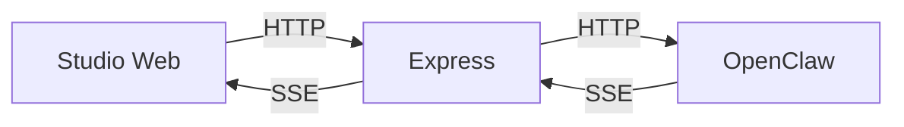

# OpenClaw Agent 消息流处理

## OpenClaw Gateway 接口

OpenClaw 网关提供了一个 Open Response 风格的 POST /v1/responses 接口。

参考：https://github.com/openclaw/openclaw/blob/main/docs/gateway/openresponses-http-api.md

## Studio Web、Express 和 OpenClaw 的调用关系

Express 是前端（Studio Web）和 OpenClaw 之间的转接层：
1. 前端与 Express 建立 SSE 连接后，Express 再与 OpenClaw 建立 SSE 连接
2. Express 转发前端的 Agent 调用请求到 OpenClaw。
3. 当 OpenClaw 开始向 Express 输出 EventStream 时，Express 将消息流原样转回前端

注意：OpenClaw 的 /v1/responses 接口需要通过在 Body 中传递 `{ "model": "agent:<agentId>" }` 来指定对话的 Agent。
