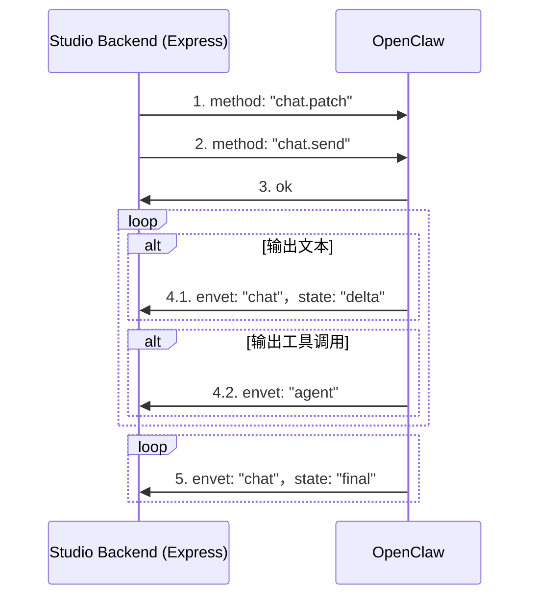
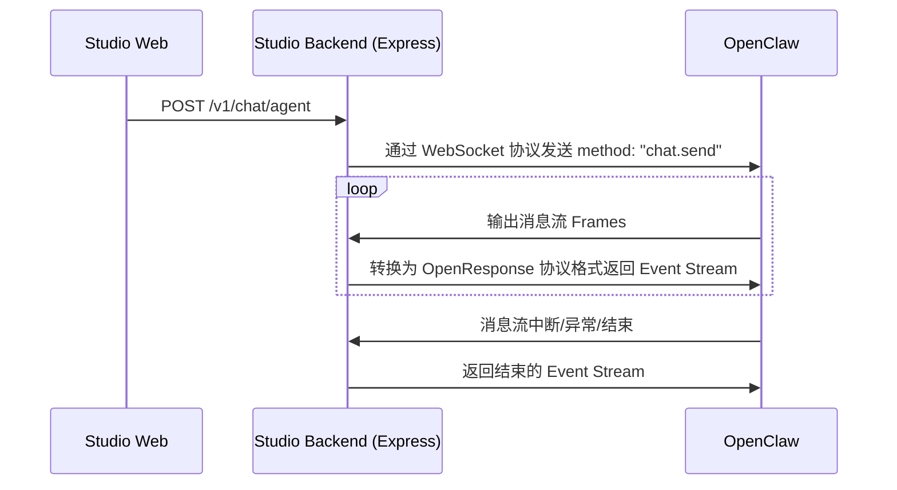

# 消息流

基于 OpenClaw WebSocket 协议的对话消息流设计。

注意：
1、若要在消息流中接收工具消息，必须：1）在建立 WebSocket 连接时声明能力 `{"caps": ["tool-events"]}` ；2）在 chat.send 之前发送 sessions.patch 来设定会话级的 verboseLevel 参数。
2、Express 接收 x-openclaw-session-key 头，并填充到发起会话的 req 的 sessionKey 中。
3、Express 需要生成一个随机 UUID 作为 idempotencyKey，在向 OpenClaw 发送 "chat.send" 时通过 params.idempotencyKey 传递。

## 业务流程

OpenClaw 提供了基于 WebSocket 协议的对话消息流，其基本流程如下：



### 消息帧（Frame）

#### 1. method: "chat.patch"

Express 侧首先向 OpenClaw 发起一个 patch 请求来设定会话级的 verboseLevel 参数，以便后续可以接收 tool 工具调用和结果消息。

```yaml
type: req
id: patch-1
method: sessions.patch
params:
  sessionKey: main
  patch:
    verboseLevel: full
```

#### 2. method: "chat.send"

Express 侧首先向 OpenClaw 发起一个 Chat 请求，例如：

```yaml
type: req
id: req-1
method: chat.send
params:
  sessionKey: main
  message: "hello"
  idempotencyKey: run-123
```


#### 3. ok

OpenClaw 侧首先向 Express 返回 OK，设置 runID 并设置 status 为 "started"

```yaml
type: res
id: req-1
ok: true
payload:
  runId: run-123
  status: started
```


#### 4. envet: "chat"，state: "delta"，seq++ 

OpenClaw 侧持续向 Express 输出流式结果，此时需要区分文本消息和工具调用两种情况。

4.1 文本消息：

```yaml
type: event
event: chat
payload:
  runId: run-123
  sessionKey: main
  seq: 1
  state: delta
  message:
    role: assistant
    content:
      - type: text
        text: "Hel"
    timestamp: 1710000000000
```

4.2 工具调用，又分为工具执行和执行结果返回。

工具执行示例如下：

```yaml
type: event
event: agent
payload:
  runId: run-123
  sessionKey: main
  seq: 2
  stream: tool
  ts: 1710000000100
  data:
    phase: start
    name: web_search
    toolCallId: tool-1
```

执行结果返回示例如下：

```yaml
type: event
event: agent
payload:
  runId: run-123
  sessionKey: main
  seq: 3
  stream: tool
  ts: 1710000000200
  data:
    phase: result
    name: web_search
    toolCallId: tool-1
    result:
      content:
        - type: text
          text: "搜索结果内容"
```

#### 5. envet: "chat"，state: "final"

对话流结束时，OpenClaw 向 Express 输出 state: "state: final"。

```yaml
type: event
event: chat
payload:
  runId: run-123
  sessionKey: main
  seq: 3
  state: final
  stopReason: stop
  message:
    role: assistant
    content:
    - type: text
      text: "Hello, world"
      timestamp: 1710000000500
```

#### 几种变体场景：

1、 运行中重复发送相同 idempotencyKey

```yaml
type: res
id: req-1
ok: true
payload:
  runId: run-123
  status: in_flight
```

2、已完成后重复发送相同 idempotencyKey

```yaml
type: res
id: req-1
ok: true
payload:
  runId: run-123
  status: ok
```

3、失败

```yaml
type: event
event: chat
payload:
  runId: run-123
  sessionKey: main
  seq: 3
  state: error
  errorMessage: "model unavailable"
```

4、被 chat.abort 中止

``` yaml
# req
type: res
id: req-abort
ok: true
payload:
  ok: true
  aborted: true
  runIds: [run-123]
```

```yaml
type: event
event: chat
payload:
  runId: run-123
  sessionKey: main
  seq: 3
  state: aborted
  stopReason: rpc
  message:
    role: assistant
    content:
      - type: text
        text: "partial text if any"
    timestamp: 1710000000400
```

#### 消息帧参考格式

WebSocket 消息帧的具体 Schema 参考：

- 文本消息：@docs/references/openclaw-websocket-rpc/chat-frames.yaml
- Agent 消息：@docs/references/openclaw-websocket-rpc/agent-frames.yaml

## WebSocket 转 SSE

Studio Backend (Express) 需要接收来自 Web 端的 SSE 请求后，通过 WebSocket 协议与 OpenClaw 通信。

Studio Backend (Express) 需要向 Studio Web 提供 OpenResponse 兼容的协议格式，参考：@docs/references/openapi/openclaw.v1.responses.yaml

业务流程如下：


