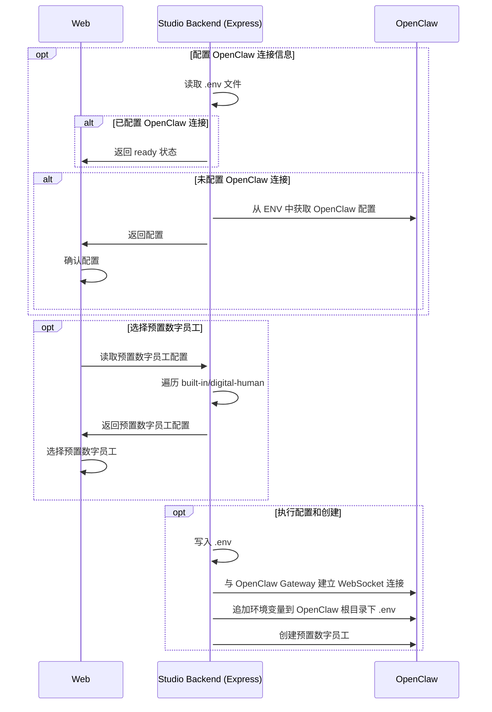
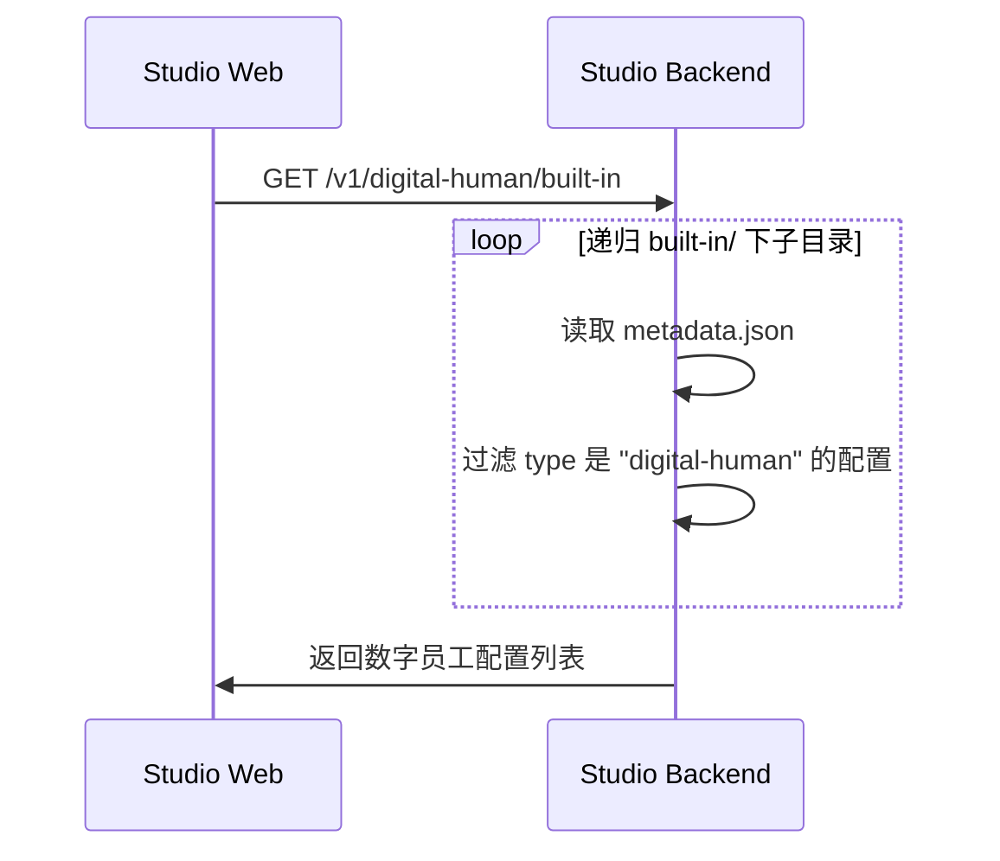
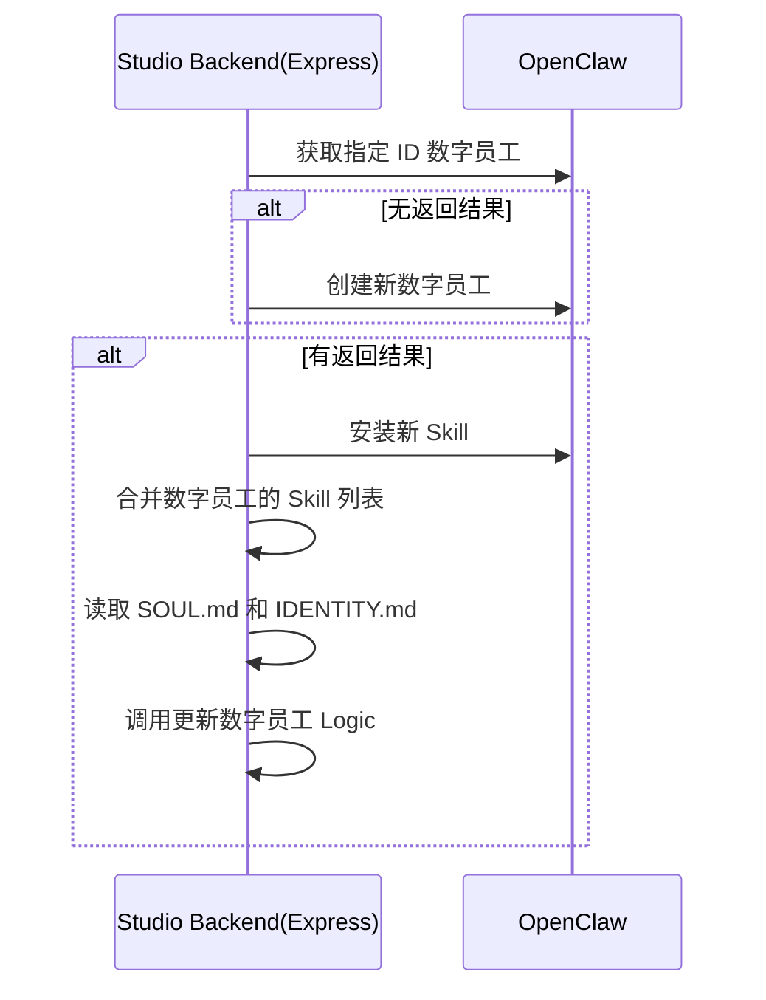
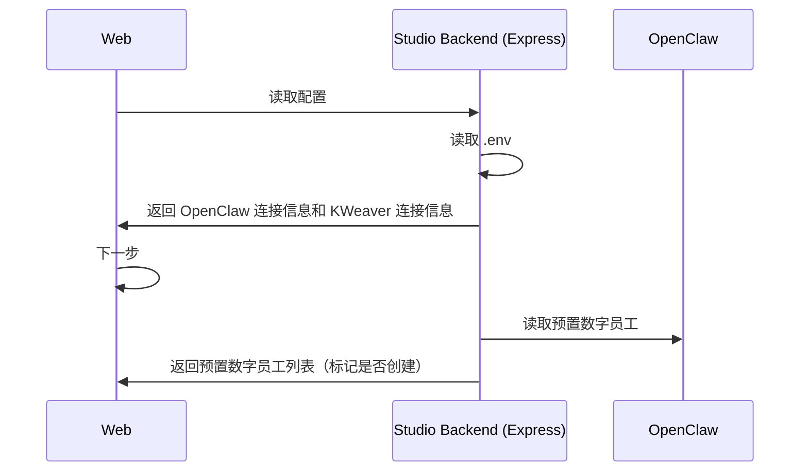

# 初始化引导

## 业务流程

前提：本业务流程**仅适用** Studio Backend (Express) 和 OpenClaw 部署在同一节点的情况。



## openclaw 命令

### 读取 OpenClaw 配置
从 .env 文件中检查以下参数：

  * OPENCLAW_GATEWAY_PROTOCOL
  * OPENCLAW_GATEWAY_HOST
  * OPENCLAW_GATEWAY_PORT
  * OPENCLAW_GATEWAY_TOKEN

如果有任意参数缺失，则表示 DIP Studio 未完成与 OpenClaw 的连接配置。

## 初始化 Studio

#### 配置连接信息

Studio Backend 读取完配置后，向前端返回配置信息，用户可以在 Web 修改配置信息。配置项包括：

* OpenClaw 网关连接地址
* OpenClaw 网关 Token（不显示明文）
* KWeaver 服务地址（访问 KWeaver API 需要，可选）
* KWeaver Token（默认禁用，如填写了 KWeaver 服务地址，则启用且必填）

用户修改并确认配置后发送初始化请求到 Studio Backend， Studio Backend 执行初始化操作：

1. 如果不存在 `.env` 文件，则先根据 `.env.example` 模板创建 `.env`。
2. 将初始化请求参数转换为 `.env` 中的对应参数填入。
3. 创建 `assets/`目录，执行 OpenSSL 命令生成 Ed25519 PEM 私钥和 PEM 公钥，用于调用 OpenClaw Gateway 接口时进行签名：
```bash
cd assets
openssl genpkey -algorithm ED25519 -out private.pem
openssl pkey -in private.pem -pubout -out public.pem
```
4. 执行 `npm run init:agents` 初始化 OpenClaw 默认配置、built-in agents 以及 extensions。
5. 初始化成功后，与 OpenClaw Gateway 建立 WebSocket 连接。
6. 连接成功后，追加 KWEAVER_BASE_URL 和 KWEAVER_TOKEN 到 {OPENCLAW_ROOT_DIR} 目录下的 .env 文件（没有则创建）

#### 创建数字员工

用户可以在系统初始化时选择是否需要创建预置的数字员工。当前版本（v0.4.0）包含两个数字员工：
* BKN Creator
* 数据分析员

创建预置数字员工的实现逻辑如下：

1. Studio Web 向 Studio Backend  请求获取预置数字员工的列表；
2. Studio Backend 读取 built-in 目录，按规则解析出数字员工的配置：


预置数字员工的存放目录遵循以下结构：
```
built-in
|-- <digital_human_folder>/
|    |-- metadata.json
|    |-- SOUL.md
|    |-- IDENTITY.md
|    |-- skills/
|        |-- *.skill
```

metadata.json 遵循以下结构：

```json
{
  "type": "digital-human",
  "id": string,
  "name": string,
  "description": string,
  "is_builtin": true
}
```

3. 用户选择需要创建的预置数字员工，这一步也可以跳过。


#### 执行初始化

在执行系统初始化时，Studio Web 需要执行两阶段调用：

* 阶段一：初始化与 OpenClaw 的连接，配置 .env 环境变量。
* 阶段二：连接成功后，创建用户选择的预置数字员工。

创建数字员工时，按以下流程执行：

1. 调用 POST /v1/skills/install 安装 `metadata.json` 所在目录 `skills/*.skill` 所有技能
2. 读取 IDENTITY.md 和 SOUL.md 以及安装的 skills 列表，调用 POST /v1/digital-human 创建数字员工。

#### 更新数字员工

在系统中已经创建数字员工的情况下，可以进行数字员工的设定和技能更新。



## 编辑系统配置

admin 在完成初始化之后，可以再次进入系统配置界面修改配置。



## HTTP 接口

Studio Backend 提供以下 HTTP 接口：

- 获取 DIP Studio 系统初始化状态；
- 获取 OpenClaw 配置；
- 完成 DIP Studio 系统初始化；
- 获取预置数字员工列表；
- 创建预置数字员工；
