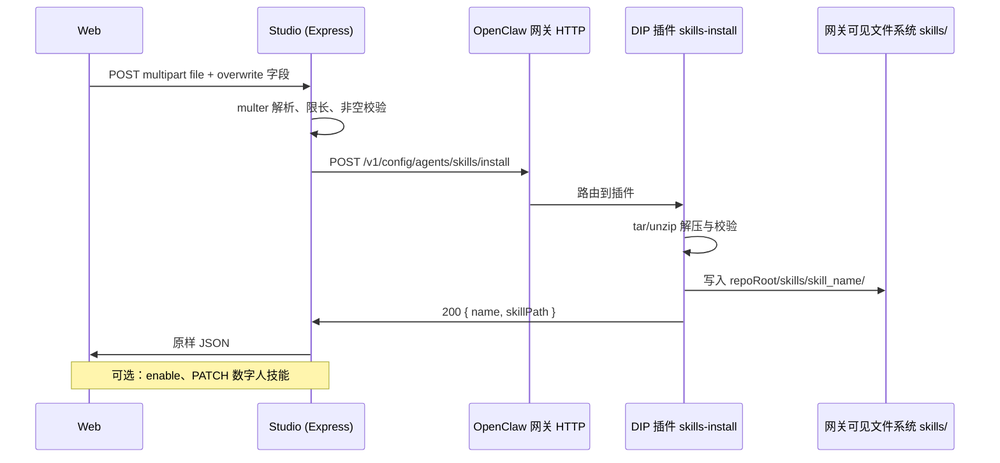

# 导入 Skill

支持用户在 Web 端上传 `.skill` 包（ZIP），经 **Studio 后端** 转发至 **OpenClaw 网关上的 DIP 插件**，由网关在 `{repoRoot}/skills/<skill_name>/` 落盘；可选再全局启用或绑定到数字人。

## 实现架构（当前）

| 层级 | 职责 |
|------|------|
| **Studio** `POST /api/dip-studio/v1/skills/install` | 接收 **`multipart/form-data`**（**非** URL 查询参数）：字段 **`file`**（ZIP）、可选 **`overwrite`**、可选 **`name`**（不传时可由上传文件名推导）；`multer` 内存存储，单文件 ≤ 32MB；将 zip 与解析后的 **`overwrite` / `name`** 通过 `DefaultOpenClawAgentSkillsHttpClient.installSkill` 转发至网关；**不在本机写入 `skills/`**。 |
| **DIP 插件** `POST /v1/config/agents/skills/install` | **请求体**为 zip 字节；用宿主 **`tar -xf` 或 `unzip`** 解压；支持**嵌套**（单一顶层目录 + `SKILL.md`）或**扁平**（zip 根含 `SKILL.md` 时须提供 `name` 或与包内布局一致）；**`overwrite` / `name`** 由网关 HTTP 层随请求传入安装逻辑（与 Studio 转发的值对应）；写入 **`path.join(repoRoot, "skills", name)`**；返回 **`name`** 与 **`skillPath`（网关主机绝对路径）**。 |

代码参考：

- Studio 路由：`src/routes/skills.ts`
- 逻辑委托：`src/logic/agent-skills.ts` → `src/infra/openclaw-agent-skills-http-client.ts`
- 插件安装：`extensions/dip/src/skills-install.ts`、`extensions/dip/src/skills-control.ts`
- OpenAPI：`docs/openapi/public/skills.paths.yaml`（`/skills/install`）、`README.md` API 章节

因此：**落盘发生在运行 OpenClaw 网关、且加载 DIP 插件的那台机器/容器**；Studio 与网关须能互通，且部署上 **`repoRoot`（插件解析的 Studio 仓库根）** 与业务期望的 `skills/` 目录一致（通常与 `OPENCLAW_WORKSPACE_DIR` 指向同一检出根，见下文）。

## 背景与现有能力

- **技能发现/状态管理**：统一由 Studio 通过 OpenClaw `skills.status` 实现；DIP 不再负责发现或归一化可用技能列表。
- **repoRoot**：`extensions/dip/index.ts` 中 `path.resolve(__dirname, "../..")` 为 **Studio 仓库根**（与 `extensions` 同级）。插件**不**读取 `OPENCLAW_WORKSPACE_DIR`；部署上应保证网关进程看到的该根与运维约定一致。
- **全局启用**：落盘后若需启用/禁用，由 Studio 侧基于 OpenClaw 配置与 `skills.status` 处理，数字人侧 `listEnabledSkills` 才展示为可用。
- **数字人绑定**：DIP `GET/POST /v1/config/agents/skills`、Studio `GET /api/dip-studio/v1/digital-human/:id/skills` 等；导入后是否自动挂到某数字人为产品可选步骤。

## .skill 文件

`.skill` 为 **ZIP** 包，扩展名常为 `.skill`；传输时 `Content-Type` 可用 `application/zip` 或 `application/octet-stream`。

### 包内目录结构

**嵌套（常见）**：zip 根下**仅一个**顶层目录 `<skill_name>/`，且含 `SKILL.md`；技能 id 取自目录名。

```text
<skill_name>/
    SKILL.md              # 必填
    scripts/              # 可选
    …
```

**扁平**：zip **根目录**含 `SKILL.md`（可与其它文件/子目录并列）；`skills/<name>/` 名由表单 **`skillName`** 指定，**不传则按上传文件名**（去后缀，命名规则与插件一致）推导。

约束与插件校验一致：

- 嵌套布局：顶层仅一个可用根目录（插件会忽略 `__MACOSX` 等）。
- `skill_name` / `skillName`（API 字段）需匹配插件内命名正则（字母数字与 `._-` 等）。
- `SKILL.md` front matter 中的 `name` 必须与 `skillName` / 目录名完全一致；不匹配视为无效安装。

### 与发现规则的对应关系

`skills/` 下识别规则见 `listSkillNamesFromDir`：

- 普通子目录名 = skill id；
- 名为 `*.skill` 的**目录或文件**，去掉后缀为 id。

当前安装路径为 **解压成目录** `{repoRoot}/skills/<skill_name>/`，与「普通子目录」一致。

## Studio 侧请求约定

- **路径**：`POST /api/dip-studio/v1/skills/install`
- **请求体**：**`multipart/form-data`**
  - **`file`**（必填）：zip 字节；`FormData.append("file", blob, "x.skill")`。
  - **`overwrite`**（可选）：字符串 **`true`** 或 **`1`** 时，向网关请求覆盖安装；**不传或其它值** → 不覆盖；目标目录已存在时网关返回 **409**（`code: CONFLICT`）。
  - **`skillName`**（可选）：覆盖默认安装名；**不传**时 Studio 用 **`file` 的原始文件名**（去 `.skill`/`.zip`）推导；嵌套单顶层目录时网关仍以 zip 内目录名为准。
- 服务端使用 **`multer` 内存存储**（`memoryStorage`），单文件上限 **32MB**；缺 `file` 或空文件 → Studio **400**；超限 → **413**。
- **成功响应** `200`：`{ "name": string, "skillPath": string }`（`name` 为技能 ID，来自 `SKILL.md` front matter；`skillPath` 为**网关主机**上的绝对路径）。
- **错误**：网关/网络错误通常封装为 **`HttpError` 502**（消息中含上游 HTTP 状态与片段）；上游 **409/400** 的透传策略可在后续迭代优化。

## 网关插件侧行为摘要

- 将 body 写入临时 zip → `tar` 或 `unzip` 解压到临时目录 → 校验布局（嵌套或扁平 + `name`）与 `SKILL.md` → 再 `cp` 到 `repoSkillsDir/<name>/`。
- 无 `overwrite` 且目标已存在 → **409** + `CONFLICT`。
- 解压失败、`SKILL.md` 缺失、布局不合法等 → **400** 及对应 `code`（如 `INVALID_ZIP`、`BAD_LAYOUT`、`MISSING_SKILL_MD`）。
- 宿主需具备 **`tar` 或 `unzip`**（PATH）；极简镜像可能需自行安装。

## 端到端流程



### 与 OpenClaw 的衔接

- 导入成功仅表示 **网关侧落盘**；发现列表刷新依赖 DIP/进程行为，可提示用户稍后刷新。
- **全局启用**、**数字人绑定**仍为独立步骤（CLI、配置或现有 HTTP API）。

## 与 `OPENCLAW_WORKSPACE_DIR` 的关系

- 插件**不**用该变量解析 `skills/`。
- 若运维将 **`OPENCLAW_WORKSPACE_DIR` 指到与 `repoRoot` 相同的物理根**，文档中可写作 `{OPENCLAW_WORKSPACE_DIR}/skills/<skill_name>/`，与 `{Studio 仓库根}/skills/...` 同义。

## 安全与运维

- **写权限**：需落在 **网关进程** 对 `{repoRoot}/skills` 可写；Studio 本身不直接写该目录。
- **配额与审计**：可在 Studio 层记录调用者、时间、skill 名（若需）。
- **内容**：ZIP 仅作容器；不在 Studio 内执行包内脚本。

## 未决 / 后续可增强

- 是否同时支持 **raw body**（`application/zip`）与 **multipart** 并存，便于非浏览器客户端。
- 上游 **409/400** 是否在 Studio **透传 HTTP 状态码**，而非统一 502。
- 导入后是否 **默认 enable**、是否 **向导绑定数字人**。
- **卸载**技能的对称 API：Studio 侧在调用插件 `DELETE /v1/config/agents/skills/<name>` 前先读取 `skills.status`，仅当条目 `source === "openclaw-managed"` 时才允许删除；其余来源会直接返回 403。
