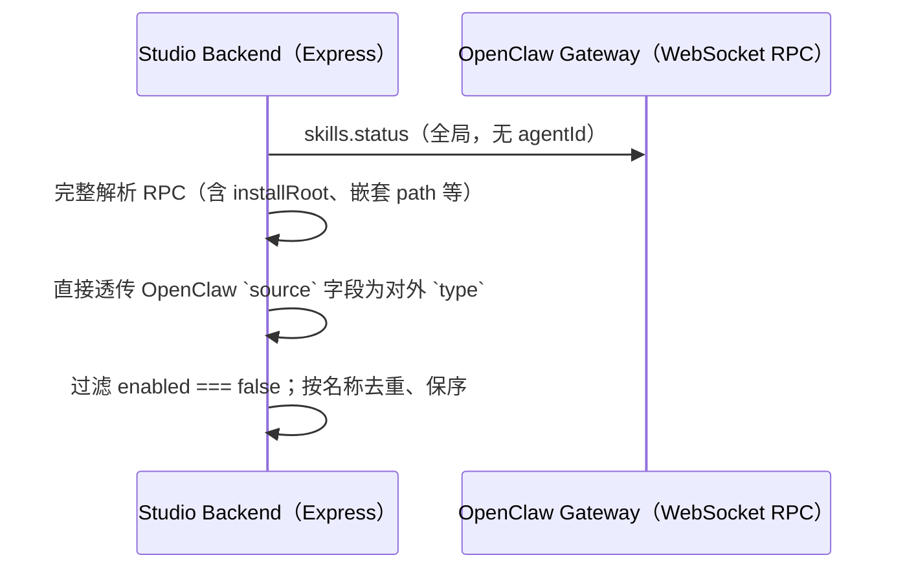
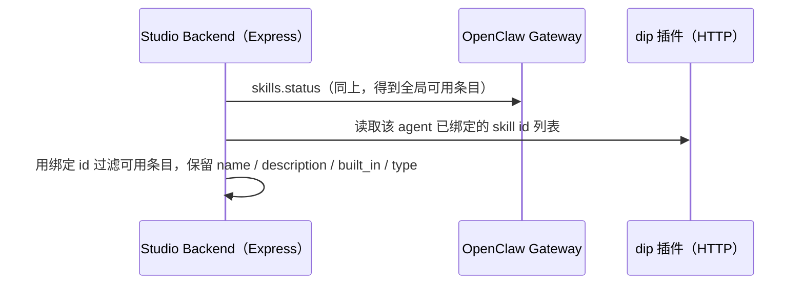
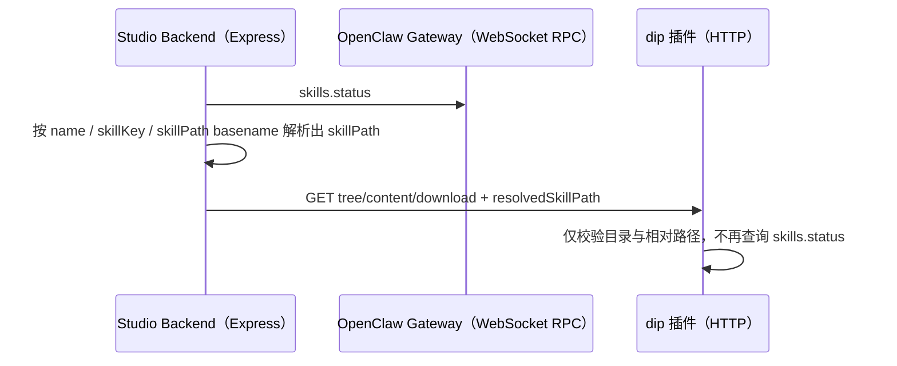

# 列举所有启用状态的 Skill

从 OpenClaw Gateway 拉取全局技能状态（`skills.status`），在 Studio 侧归一化并过滤为「可用」技能；对数字员工维度再与 `dip` 插件返回的 agent 技能绑定求交。响应中的 `name` 即技能 ID，同时作为展示名称（来自 `SKILL.md`），并直接透传 `source` 作为 `type`。

## Logic

### 获取全局 Skills（可用列表）

- RPC 定义见 @docs/references/openclaw-websocket-rpc/skills.md（`skills.status`）。
- 直接透传网关条目中的 `source` 字段（例如 `openclaw-bundled`、`openclaw-managed`、`openclaw-extra`、`agents-skills-personal`）。

### 获取指定数字员工（Agent）的 Skills 列表

- Agent 绑定列表来自网关 HTTP 层对 `dip` 插件的封装（见 @docs/references/extensions-gateway-openapi/skills-control.paths.yaml 及 Studio 内 `openclaw-agent-skills-http-client`）。

## HTTP 接口

公开前缀：`/api/dip-studio/v1`。

| 说明 | 方法 | 路径 |
| -- | -- | -- |
| 全局启用技能列表（含 `type`） | GET | `/api/dip-studio/v1/skills` |
| 技能目录树 | GET | `/api/dip-studio/v1/skills/{name}/tree` |
| 技能文件预览 | GET | `/api/dip-studio/v1/skills/{name}/content?path=<relative-file-path>` |
| 技能文件下载 | GET | `/api/dip-studio/v1/skills/{name}/download?path=<relative-file-path>` |
| 指定数字员工已配置技能列表 | GET | `/api/dip-studio/v1/digital-human/{id}/skills` |

## 技能内容读取链路

- `resolvedSkillPath` 是 Studio 到插件的内部查询参数，不对外暴露给前端。
- 插件侧只负责本地文件系统访问；技能目录的权威来源由 Studio 基于 `skills.status` 决定。
