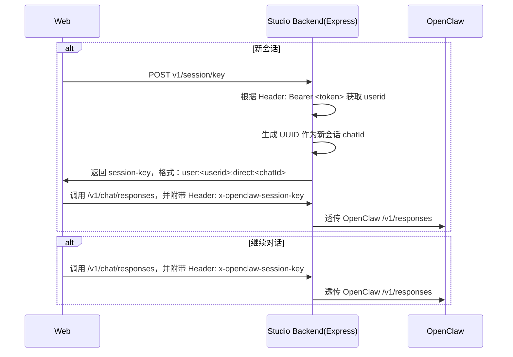

# SessionKey

## session 结构
OpenClaw 通过 session 字符串来标记不同的会话。

session 结构是：agent:<agentId>:<rest>

- 第一段是固定字符串“agent“
- 第二段是会话的 Agent ID
- 第三段是不同场景下的自定义片段

`x-openclaw-session-key` 能够定义的是 <rest> 部分。

### 常见 <rest> 形态：

**主会话：main**
例子：agent:main:main

**私聊会话：**
- direct:<peerId>
- slack:direct:<peerId>
- slack:<accountId>:direct:<peerId>

**- 群 / 频道会话：**
- <channel>:group:<peerId>
- <channel>:channel:<peerId>

**线程 / 话题会话：**
在基础 key 后追加 :thread:<threadId>
- 例子：agent:main:telegram:group:123:thread:42

**subagent 会话：**
subagent:<id>，或者更深层嵌套
- 例子：agent:main:subagent:test

**cron 会话：**
cron:<jobId>:run:<runId>

**ACP 会话：**
acp:<id>

## 自定义 sessionKey

OpenClaw 支持在调用 /v1/responses 接口时传入 `x-openclaw-session-key` 来设定 <rest> 片段。

## x-openclaw-session-key 规则：

用户与数字员工进行对话时，可选在 Header 传递 `x-openclaw-session-key` 来指定会话。结构为：`user:<userid>:direct:<chatId>`
- 例子：`user:2a664704-5e18-11e3-a957-dcd2fc061e41:direct:4d1905d7-1f7b-4f0d-b9bf-6b6b7a5b2f29`

业务流程：

